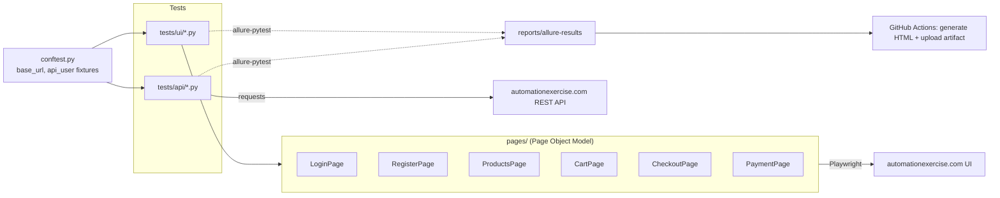

# E-commerce Automation Framework — automationexercise.com

[](https://github.com/veri-jpg/ecommerce-automation-framework/actions/workflows/test.yml)

QA automation portfolio project: end-to-end UI testing (Page Object Model) and public REST API testing against [automationexercise.com](https://automationexercise.com), built with Playwright + pytest.

Repo: [github.com/veri-jpg/ecommerce-automation-framework](https://github.com/veri-jpg/ecommerce-automation-framework)

## Tujuan Project

Menunjukkan kemampuan full-stack test automation dalam satu framework:
- UI testing dengan Page Object Model (bukan script linear)
- Data-driven testing (parametrize + JSON)
- Hybrid testing: setup data lewat API, verifikasi lewat UI (dan sebaliknya)
- Reporting profesional (Allure)
- Test tagging (`smoke` / `regression`)
- CI/CD pipeline (GitHub Actions)

## Tech Stack

| Layer | Tools |
|---|---|
| Browser automation | Playwright (sync API, Python) |
| Test runner | pytest, pytest-playwright |
| API testing | requests |
| Test data | Faker (dynamic), JSON (static combinations) |
| Reliability | pytest-rerunfailures (retry flaky live-site failures) |
| Reporting | allure-pytest |
| Config | python-dotenv (`.env`) |
| CI/CD | GitHub Actions |

## Struktur Folder

```
ecommerce-automation-framework/
├── pages/                  → Page Object Model (satu class per halaman)
├── tests/
│   ├── ui/                 → skenario UI (login, register, cart, checkout)
│   └── api/                → skenario API (products, brands)
├── data/                   → test data JSON (data-driven)
├── reports/                → hasil Allure (di-generate, tidak di-commit)
├── .github/workflows/      → CI/CD pipeline
├── conftest.py             → fixtures pytest (base_url, api_user, dsb.)
├── pytest.ini              → config & markers
├── .env / .env.example     → base URL & environment
└── requirements.txt
```

Tidak ada folder `utils/` terpisah — konfigurasi `.env` cukup sederhana sehingga ditangani langsung di `conftest.py`, tanpa lapisan abstraksi tambahan.

## Arsitektur



## Cara Menjalankan Test Secara Lokal

```bash
git clone https://github.com/veri-jpg/ecommerce-automation-framework.git
cd ecommerce-automation-framework
python -m pip install -r requirements.txt
python -m playwright install chromium

# jalankan semua test
python -m pytest

# hanya smoke test (login, checkout - subset cepat)
python -m pytest -m smoke

# hanya regression
python -m pytest -m regression

# dengan Allure raw results
python -m pytest --alluredir=reports/allure-results
```

> **Penting (khusus Windows dengan banyak instalasi Python):** selalu pakai `python -m pip ...` dan `python -m pytest ...`, jangan `pip ...` / `pytest ...` langsung. Kalau di mesinmu ada lebih dari satu Python terpasang (cek dengan `py --list` di Windows), perintah `pip`/`pytest` tanpa `python -m` bisa resolve ke interpreter yang berbeda dari yang menjalankan `python`, sehingga package yang baru di-install "tidak ketemu" saat test dijalankan (`ModuleNotFoundError`). Pastikan juga hanya menjalankan `pip install` dan `playwright install` dengan **satu** `python` yang sama secara konsisten.

Base URL diatur lewat `.env` (`BASE_URL=https://automationexercise.com`). Untuk ganti environment, cukup ubah file ini — tidak perlu ubah kode test.

## Skenario Test

**UI (`tests/ui/`)**
- `test_login.py` — data-driven negative login (`data/login_data.json`: format email salah, field kosong, email tak terdaftar) + hybrid test (akun dibuat via API, verifikasi login salah & login sukses lewat UI)
- `test_register.py` — registrasi akun baru lewat UI → verifikasi welcome message "Logged in as {name}"
- `test_search_and_cart.py` — search produk → tambah ke cart → verifikasi jumlah item di cart
- `test_checkout.py` — akun dibuat via API (cepat & stabil) → login → add to cart → checkout → bayar → verifikasi "Order Placed!"

**API (`tests/api/`)**
- `test_products_api.py` — `GET /api/productsList`: status code, response time, struktur JSON, plus negative case (method tidak didukung)
- `test_brands_api.py` — `GET /api/brandsList`: status code, response time, struktur JSON, plus negative case

Semua akun yang didaftarkan (baik lewat UI maupun API) dihapus lagi di akhir test (`delete_account_and_confirm()` / fixture `api_user` teardown), karena automationexercise.com adalah **situs publik yang dipakai bersama** — bukan sandbox per-user.

## Data-Driven Testing

`data/login_data.json` berisi kombinasi data login negatif beserta `expected_behavior`:
- `client_validation` — field kosong / format email salah diblokir validasi HTML5 browser (tidak pernah sampai ke server)
- `server_error` — email berformat valid tapi tidak terdaftar → server menampilkan "Your email or password is incorrect!"

Test membaca file ini lewat `@pytest.mark.parametrize`, tidak ada data yang di-hardcode di test.

## Markers

Didefinisikan di `pytest.ini`:
- `smoke` — jalur kritis (login, checkout) untuk feedback cepat di CI
- `regression` — cakupan lebih luas, dijalankan di luar jalur kritis

## Reporting (Allure)

```bash
python -m pytest --alluredir=reports/allure-results
```

Untuk generate laporan HTML interaktif secara lokal dibutuhkan [Allure commandline](https://allurereport.org/docs/gettingstarted-installation/) (butuh Java 8+):

```bash
allure generate reports/allure-results --clean -o reports/allure-report
allure open reports/allure-report
```

`allure open` men-serve report lewat HTTP lokal lalu buka browser — jangan buka `index.html` langsung sebagai file, laporannya tidak akan bisa load data (fetch JS-nya butuh HTTP, bukan `file://`).

Setiap test UI (lulus maupun gagal) otomatis dapat screenshot yang ter-attach ke Allure — `final-state-screenshot` untuk yang lulus, `failure-screenshot` untuk yang gagal. Diimplementasikan lewat hook `pytest_runtest_makereport` di `conftest.py` (bukan fixture terpisah, supaya tidak kena masalah urutan teardown dengan fixture `page` bawaan pytest-playwright).

Di CI, laporan HTML di-generate otomatis dan diunggah sebagai artifact — tidak perlu instalasi Allure/Java secara lokal untuk melihat hasilnya, cukup download artifact dari halaman run GitHub Actions.

## CI/CD

`.github/workflows/test.yml` berjalan tiap push/PR ke `main`:
1. Install dependencies + Playwright browser (chromium)
2. Jalankan test dengan marker `smoke`
3. Generate Allure HTML report
4. Upload report sebagai artifact

## Catatan

- Test berjalan terhadap situs live pihak ketiga, sehingga bisa sesekali flaky karena jaringan/latency — `pytest-rerunfailures` mengatur 1x retry otomatis (`--reruns 1` di `pytest.ini`).
- Karena automationexercise.com dipakai bersama banyak orang, semua data yang dibuat test (akun, dsb.) unik per run (`Faker`/`uuid`) dan dibersihkan lagi setelah test selesai.
